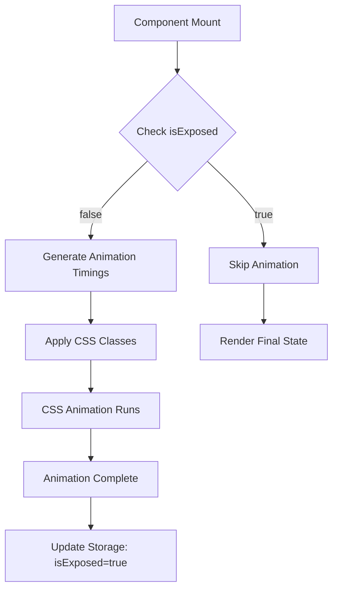

# Phase 2: Polaroid Drop Animation - Implementation Handoff Package

## 🎯 Objective
Implement a realistic 3D falling animation where polaroids appear to drop from the user's perspective onto the canvas, creating a natural, physics-based effect that enhances the user experience.

## 📋 Quick Start Checklist

- [ ] Review animation reference videos in `/docs/animation-reference/`
- [ ] Run the prototype: `cd prototype && npm run dev`
- [ ] Read browser compatibility notes below
- [ ] Set up your testing environment
- [ ] Create a working branch from `feat/polaroid-development-animations`

## 🎬 Animation Specification

### Visual Effect Description
Polaroids should appear to fall from behind the user (close to camera) down onto the canvas (far from camera). This creates a natural depth effect where polaroids start large and shrink as they fall away.

### Technical Parameters

```css
/* Starting State (t=0) */
.polaroid {
  transform: translateZ(800px) scale(2.5) rotate(var(--random-rotation));
  opacity: 0;
}

/* Ending State (t=800ms) */
.polaroid {
  transform: translateZ(0px) scale(1.0) rotate(0deg);
  opacity: 1;
}
```

### Animation Properties
- **Duration**: 800ms
- **Easing**: cubic-bezier(0.25, 0.46, 0.45, 0.94) (ease-out)
- **Delay**: 0-300ms (randomized per polaroid)
- **Stagger Pattern**: Based on polaroid ID hash for consistency

## 🏗️ Architecture Overview



## 💻 Implementation Guide

### Step 1: Animation Utilities
Location: `src/utils/polaroidAnimations.ts`

```typescript
interface AnimationTimings {
  dropDelay: number;      // 0-300ms
  dropDuration: number;   // Always 800ms
  rotation: number;       // -5 to 5 degrees
}

function generateDropTimings(id: string): AnimationTimings {
  const hash = hashString(id);
  return {
    dropDelay: (hash % 300),
    dropDuration: 800,
    rotation: ((hash % 11) - 5)
  };
}
```

### Step 2: CSS Keyframes
Location: `src/components/Polaroid.module.css`

```css
/* Container must have perspective */
.polaroid-container {
  perspective: 1000px;
  transform-style: preserve-3d;
}

/* Drop animation keyframes */
@keyframes polaroidDrop {
  0% {
    transform: translateZ(800px) scale(2.5) rotate(var(--drop-rotation));
    opacity: 0;
  }
  10% {
    opacity: 1;
  }
  100% {
    transform: translateZ(0) scale(1) rotate(0deg);
    opacity: 1;
  }
}

/* Animation class */
.polaroid.dropping {
  animation: polaroidDrop var(--drop-duration) var(--drop-delay) cubic-bezier(0.25, 0.46, 0.45, 0.94) forwards;
}
```

### Step 3: Component Integration
Location: `src/components/Polaroid.tsx`

```typescript
// Add to component
const [animationClass, setAnimationClass] = createSignal("");

createEffect(() => {
  if (!props.isExposed && typeof window !== 'undefined') {
    const timings = generateDropTimings(props.id);
    setAnimationClass("dropping");
    
    // Set CSS custom properties
    polaroidRef.style.setProperty('--drop-delay', `${timings.dropDelay}ms`);
    polaroidRef.style.setProperty('--drop-duration', `${timings.dropDuration}ms`);
    polaroidRef.style.setProperty('--drop-rotation', `${timings.rotation}deg`);
  }
});
```

## 🧪 Testing Strategy

### Automated Tests

```typescript
// tests/animations.test.ts
describe('Polaroid Drop Animation', () => {
  it('should not animate if isExposed is true', async () => {
    const { container } = render(() => 
      <Polaroid id="test-1" isExposed={true} />
    );
    expect(container.querySelector('.dropping')).toBeNull();
  });

  it('should apply animation class when not exposed', async () => {
    const { container } = render(() => 
      <Polaroid id="test-2" isExposed={false} />
    );
    expect(container.querySelector('.dropping')).toBeTruthy();
  });

  it('should generate consistent timings for same ID', () => {
    const timings1 = generateDropTimings('photo-1');
    const timings2 = generateDropTimings('photo-1');
    expect(timings1).toEqual(timings2);
  });
});
```

### Manual Testing Checklist

1. **Visual Quality**
   - [ ] Animation feels natural and physics-based
   - [ ] No jank or stuttering
   - [ ] Proper 3D depth effect
   - [ ] Smooth opacity transition

2. **Performance**
   - [ ] 60 FPS with 10 polaroids
   - [ ] No frame drops on mobile
   - [ ] GPU acceleration working
   - [ ] Memory usage stable

3. **State Management**
   - [ ] Animation only plays once per polaroid
   - [ ] State persists to localStorage
   - [ ] Refresh shows final state immediately

4. **Edge Cases**
   - [ ] Works with 1 polaroid
   - [ ] Works with 20+ polaroids
   - [ ] Handles rapid navigation
   - [ ] No SSR hydration issues

## 🐛 Common Issues & Solutions

### Issue 1: Animation Jank
**Symptom**: Stuttering or low FPS
**Solution**: 
```css
.polaroid {
  will-change: transform, opacity;
  transform: translateZ(0); /* Force GPU acceleration */
}
```

### Issue 2: Z-Index Conflicts
**Symptom**: Polaroids appear in wrong order
**Solution**: Use 3D transforms instead of z-index during animation

### Issue 3: SSR Hydration Mismatch
**Symptom**: Console errors about mismatched HTML
**Solution**: Ensure animation classes only apply client-side

## 📊 Performance Budget

- **Target FPS**: 60fps minimum
- **Max Polaroids**: 20 simultaneous animations
- **Animation Start**: < 100ms after mount
- **Total Duration**: < 1100ms (800ms + max 300ms delay)
- **Memory Impact**: < 10MB additional

## 🔄 Integration Points

### Files to Modify
1. `src/components/Polaroid.tsx` - Add animation logic
2. `src/components/Polaroid.module.css` - Add keyframes
3. `src/utils/polaroidAnimations.ts` - Expand with drop timings
4. `src/utils/storage.ts` - Already has isExposed support

### Existing Code to Preserve
- Current drag/drop functionality
- Position state management
- Infinite canvas integration
- SSR compatibility

## 📈 Success Criteria

1. **Visual**: Animation matches the prototype exactly
2. **Performance**: Maintains 60fps with 10+ polaroids
3. **Reliability**: No animation glitches or state bugs
4. **Code Quality**: Clean, well-documented implementation
5. **Testing**: All automated tests pass + manual QA complete

## 🚀 Deployment Checklist

- [ ] All tests passing
- [ ] Performance benchmarks met
- [ ] Cross-browser testing complete
- [ ] Mobile testing complete
- [ ] Code review approved
- [ ] Documentation updated
- [ ] No console errors
- [ ] Animation demo GIF created for PR

## 📚 Resources

- [CSS Transforms MDN](https://developer.mozilla.org/en-US/docs/Web/CSS/transform)
- [Web Animations Performance](https://web.dev/animations-performance/)
- [SolidJS Animation Guide](https://www.solidjs.com/guides/animations)
- [GPU Acceleration Best Practices](https://web.dev/gpu/)

## 💡 Pro Tips

1. **Use CSS custom properties** for dynamic values instead of inline styles
2. **Test with CPU throttling** to ensure smooth performance on slower devices
3. **Record animations** with Chrome DevTools for frame-by-frame analysis
4. **Use transform3d()** instead of translateZ() for better browser support
5. **Batch DOM updates** using SolidJS batch() for multiple polaroids

---

## Need Help?

- Review the prototype code in `/prototype/drop-animation/`
- Check the visual references in `/docs/animation-reference/`
- See common solutions in `/docs/troubleshooting.md`
- Ask in #peach-preserves-dev channel

Remember: The goal is a buttery smooth, realistic animation that delights users without sacrificing performance.